# Filament Leaflet

A powerful and elegant Leaflet integration for Filament PHP that makes creating interactive maps a breeze. Build beautiful, feature-rich maps with markers, clusters, shapes, and more using a fluent, expressive API.

## Features

- 🗺️ **Interactive Maps** - Full Leaflet integration with customizable tile layers
- 📍 **Markers & Clusters** - Beautiful markers with popup/tooltip support and intelligent clustering
- 🎨 **Shapes** - Circles, polygons, polylines, rectangles, and circle markers
- 🎯 **Click Events** - Handle clicks on markers, shapes, and the map itself
- 📊 **GeoJSON Support** - Display density maps with custom color schemes
- 🔄 **Model Binding** - Automatically create markers from Eloquent models
- 🎨 **Multiple Tile Layers** - Switch between OpenStreetMap, Satellite, and custom layers
- 💾 **CRUD Operations** - Create markers directly from map clicks
- 🎭 **Customizable** - Extensive configuration options for every element

### Latest Features

- **Form Field (MapPicker)** - Pick coordinates directly in forms with automatic latitude/longitude sync or JSON storage
- **Table Column (MapColumn)** - Display maps in Filament table columns for at-a-glance location visualization
- **Infolist Entry (MapEntry)** - Display read-only maps in Filament infolists
- **Model GeoJSON Files** - Automatic GeoJSON loading from models with `HasGeoJsonFile` trait
- **Layer Groups** - Organize markers and shapes with automatic coverage area calculation
- **Editable Layers & Draw Control** - Edit markers and shapes directly on the map
- **Dynamic Icons** - Marker icons with automatic sizing and anchor point calculation
- **Heroicon Support** - Use Filament Heroicons directly in markers with automatic SVG rendering
- **Enhanced Shapes** - Factory methods (`fromRecord()`) for all shape classes with support for JSON columns
- **JSON Storage** - Store coordinates as JSON in single database column
- **Map Interaction Control** - Toggle dragging, zooming, and auto-recenter behavior
- **Static Maps** - Display read-only maps with automatic interaction disabling
- **Auto-Recenter** - Automatically recenter maps after users pan around
- **Mapbox Tile Layer Support** - New tile layer provider with configurable Access Token and tile size
- **Marker CRUD Actions** - Built-in view, edit, and delete actions for markers on the map
- **Coordinate DTO** - Improved handling of latitude/longitude pairs with dedicated DTO class

## Installation

```bash
composer require eduardoribeirodev/filament-leaflet
```

Publish the assets:

```bash
php artisan vendor:publish --tag=filament-leaflet
```

This will publish the Leaflet assets used by the package.

## Table of Contents

- [Installation](#installation)
- [Core Components](#core-components)
  - [Map Widget](#map-widget)
  - [MapPicker (Form Field)](#mappicker-form-field)
  - [MapColumn (Table Column)](#mapcolumn-table-column)
  - [MapEntry (Infolist)](#mapentry-infolist)
- [Map Elements](#map-elements)
  - [Markers](#markers)
  - [Layer Groups](#layer-groups)
  - [Shapes](#shapes)
  - [Editable Layers](#editable-layers)
- [User Interactions](#user-interactions)
- [Advanced Features](#advanced-features)
- [Best Practices](#best-practices)
- [Configuration Reference](#configuration-reference)
  - [Method Reference](#method-reference)
  - [Concern Methods Reference](#concern-methods-reference)

## Core Components

### Map Widget

Create your first interactive map widget:

```php
namespace App\Filament\Widgets;

use EduardoRibeiroDev\FilamentLeaflet\Widgets\MapWidget;
use EduardoRibeiroDev\FilamentLeaflet\Support\Markers\Marker;

class MyMapWidget extends MapWidget
{
    protected ?string $heading = 'My Locations';
    protected array $mapCenter = [-23.5505, -46.6333];
    protected int $defaultZoom = 12;
    protected int $mapHeight = 600;
    
    protected function getMarkers(): array
    {
        return [
            Marker::make(-23.5505, -46.6333)
                ->title('São Paulo')
                ->popupContent('The largest city in Brazil'),
        ];
    }
}
```

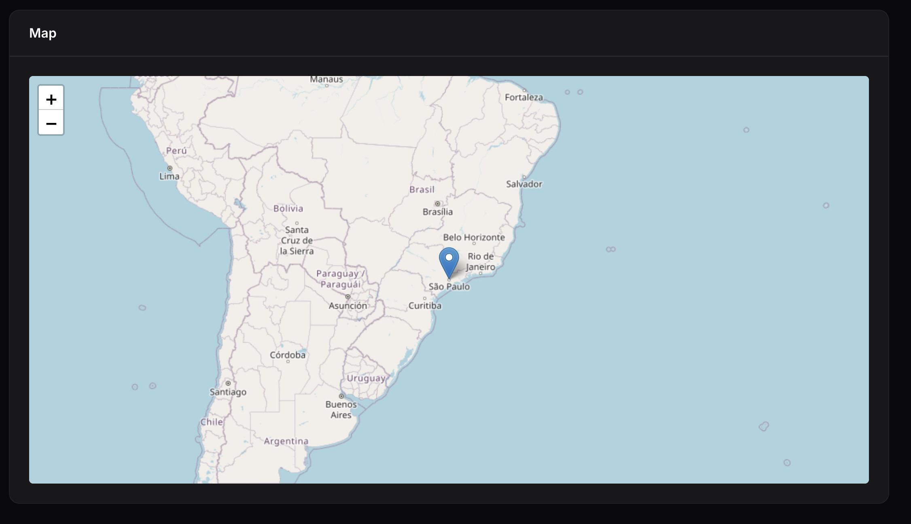

#### Basic Configuration

```php
class MyMapWidget extends MapWidget
{
    // Display
    protected ?string $heading = 'Store Locations';
    protected int $mapHeight = 600;
    
    // Map center and zoom
    protected array $mapCenter = [-14.235, -51.9253];
    protected int $defaultZoom = 4;
    protected int $maxZoom = 18;
    protected int $minZoom = 2;
}
```

#### Map Interaction Control

Control how users interact with your map:

```php
class MyMapWidget extends MapWidget
{
    // Allow/prevent dragging
    protected bool $mapDraggable = true;
    
    // Allow/prevent zooming (scroll wheel, pinch)
    protected bool $mapZoomable = true;
    
    // Auto-recenter after user pans (in milliseconds)
    // Set to null to disable
    protected ?int $recenterMapTimeout = 5000;  // Recenter after 5 seconds
    
    // Auto-center to user's current location
    protected bool $autoCenter = false;
}
```

**Static Maps** - Disable all interactions:

```php
MapPicker::make('location')
    ->static()  // Equivalent to ->mapDraggable(false)->mapZoomable(false)
```

#### Controls

Enable/disable map controls:

```php
class MyMapWidget extends MapWidget
{
    protected bool $hasAttributionControl = true;
    protected bool $hasScaleControl = true;
    protected bool $hasZoomControl = true;
    protected bool $hasFullscreenControl = true;
    protected bool $hasSearchControl = true;

    protected bool $hasDrawMarkerControl = true;
    protected bool $hasDrawCircleMarkerControl = true;
    protected bool $hasDrawCircleControl = true;
    protected bool $hasDrawPolylineControl = true;
    protected bool $hasDrawRectangleControl = true;
    protected bool $hasDrawPolygonControl = true;
    protected bool $hasDrawTextControl = true;
    protected bool $hasEditLayersControl = true;
    protected bool $hasDragLayersControl = true;
    protected bool $hasRemoveLayersControl = true;
    protected bool $hasRotateLayersControl = true;
    protected bool $hasCutPolygonControl = true;
}
```

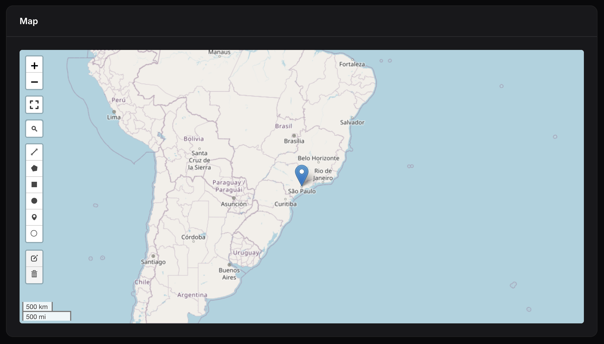

Conditionally show controls at runtime:

```php
protected function hasDrawCircleControl(): bool
{
    return auth()?->user()?->is_admin;
}
```

#### Tile Layers

Choose from multiple providers or add custom layers:

```php
use EduardoRibeiroDev\FilamentLeaflet\Enums\TileLayer;

class MyMapWidget extends MapWidget
{
    // Single layer
    protected TileLayer|string|array $tileLayersUrl = TileLayer::OpenStreetMap;
    
    // Multiple layers
    protected TileLayer|string|array $tileLayersUrl = [
        'Street Map' => TileLayer::OpenStreetMap,
        'Satellite' => TileLayer::GoogleSatellite,
        'Custom' => 'https://{s}.tile.custom.com/{z}/{x}/{y}.png',
    ];
}
```


**Available providers:** `OpenStreetMap`, `GoogleStreets`, `GoogleSatellite`, `GoogleHybrid`, `GoogleTerrain`, `EsriWorldImagery`, `EsriWorldStreetMap`, `EsriNatGeo`, `CartoPositron`, `CartoDarkMatter`, `Mapbox`

**Mapbox Tile Layer:**

To use Mapbox tiles, configure your access token in `.env` or `config/services.php`:

**Environment variables:**

```env
MAPBOX_ACCESS_TOKEN=your_mapbox_access_token_here
MAPBOX_TILE_SIZE=512
```

**Or in config/services.php:**

```php
'mapbox' => [
    'token' => env('MAPBOX_ACCESS_TOKEN'),
    'tile_size' => env('MAPBOX_TILE_SIZE', 512),
],
```

Then use the Mapbox tile layer in your widget:

```php
use EduardoRibeiroDev\FilamentLeaflet\Enums\TileLayer;

class MyMapWidget extends MapWidget
{
    // Single Mapbox layer
    protected TileLayer|string|array $tileLayersUrl = TileLayer::MapboxStreets;
}
```

**Available Mapbox providers:**

- `TileLayer::MapboxStreets` - Streets layer
- `TileLayer::MapboxOutdoors` - Outdoors layer
- `TileLayer::MapboxLight` - Light layer
- `TileLayer::MapboxDark` - Dark layer
- `TileLayer::MapboxSatellite` - Satellite layer

**Or use multiple Mapbox layers:**

```php
protected TileLayer|string|array $tileLayersUrl = [
    'Street Map' => TileLayer::OpenStreetMap,
    'Mapbox Streets' => TileLayer::MapboxStreets,
    'Mapbox Satellite' => TileLayer::MapboxSatellite,
    'Mapbox Outdoors' => TileLayer::MapboxOutdoors,
];
```

### MapPicker (Form Field)

Add an interactive map inside Filament forms. It syncs map clicks to form fields and supports all MapWidget configuration methods.

```php
use EduardoRibeiroDev\FilamentLeaflet\Fields\MapPicker;
use EduardoRibeiroDev\FilamentLeaflet\Enums\TileLayer;

MapPicker::make('location')
    ->height(300)
    ->center(-23.5505, -46.6333)
    ->zoom(11)
    ->autoCenter()  // Auto-center to user's location
    ->tileLayersUrl(TileLayer::OpenStreetMap)
    ->columnSpanFull()
```

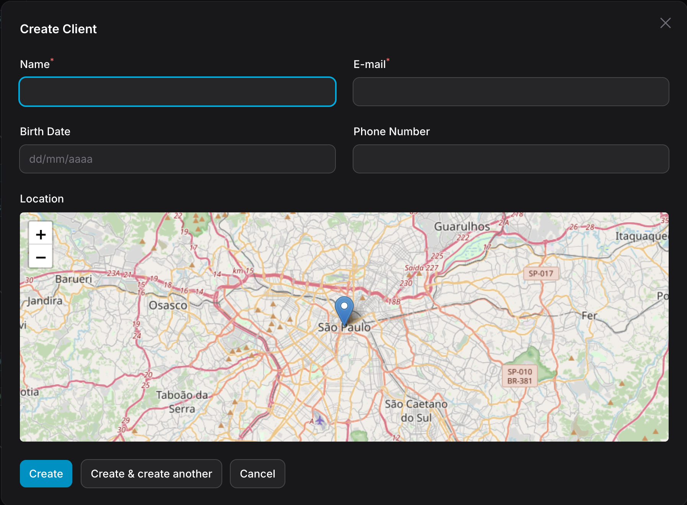

**Default behavior:** Updates form's `latitude` and `longitude` fields. Customize with:

```php
MapPicker::make('location')
    ->latitudeFieldName('lat')
    ->longitudeFieldName('lng')
```

**Store as JSON:** Keep coordinates in a single column:

```php
MapPicker::make('location')
    ->storeAsJson()  // Stores: { "latitude": -23.5505, "longitude": -46.6333 }
```

**Load GeoJSON:** Automatically loads from models with `HasGeoJsonFile` trait or `getGeoJsonUrl()` method:

```php
use EduardoRibeiroDev\FilamentLeaflet\Concerns\HasGeoJsonFile;

class DeliveryZone extends Model
{
    use HasGeoJsonFile;
    
    public function getGeoJsonFileAttributeName(): string
    {
        return 'geojson_file';
    }

    public function getGeoJsonFileDisk(): ?string
    {
        return 's3';
    }

    public function getExpirationTime(): ?DateTime
    {
        return now()->addHour();
    }
}
```

**Customize pick marker:** Visual feedback when clicking the map:

```php
MapPicker::make('location')
    ->pickMarker(fn(Marker $marker) => $marker->blue()->title('Selected'))
```

**Dynamic configuration:** Most methods accept closures:

```php
MapPicker::make('location')
    ->center(fn() => [$lat, $lng])
    ->height(fn($record) => 300)
    ->zoom(fn($record) => $record->zoom_level)
    ->mapDraggable(fn($record) => $record->is_editable)
    ->recenterTimeout(fn($record) => $record->is_read_only ? 3000 : null)
```

### MapColumn (Table Column)

Display maps directly in Filament table columns:

```php
use EduardoRibeiroDev\FilamentLeaflet\Tables\MapColumn;
use EduardoRibeiroDev\FilamentLeaflet\Support\Markers\Marker;

MapColumn::make('location')
    ->height(100)
    ->zoom(8)
    ->pickMarker(fn(Marker $marker) => $marker->black())
    ->static()    // Disable interactions in table preview
```


Display circular maps for a unique visual style:

```php
MapColumn::make('location')
    ->height(72)
    ->zoom(5)
    ->pickMarker(fn(Marker $marker) => $marker->iconSize([14, 25]))
    ->circular()  // Optional: circular display
```

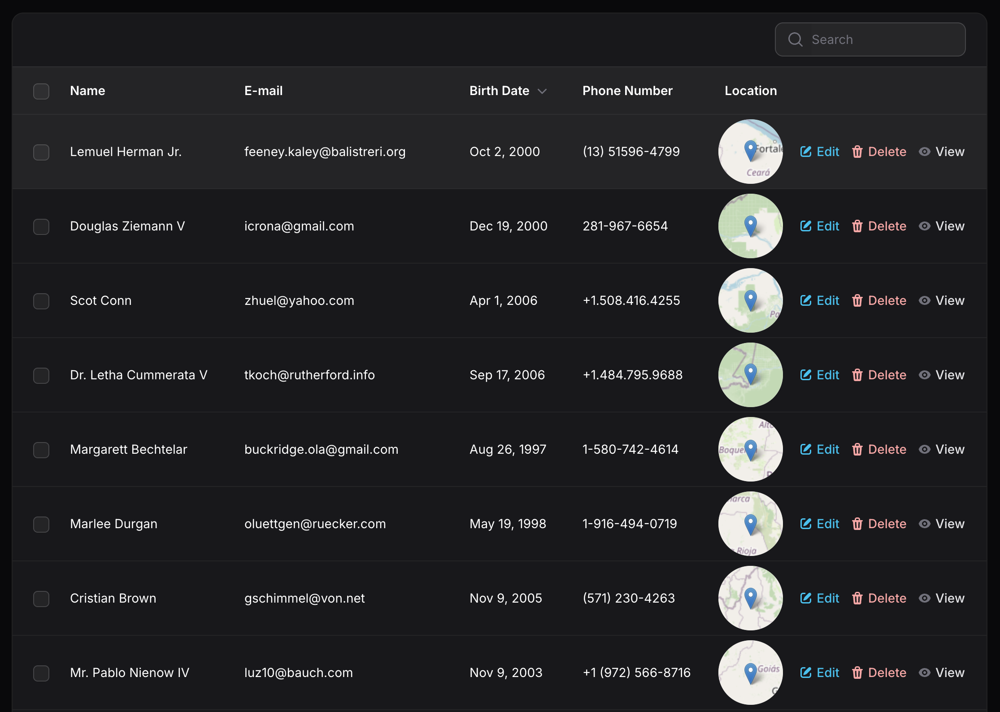

### MapEntry (Infolist)

Display read-only maps in Filament infolists:

```php
use EduardoRibeiroDev\FilamentLeaflet\Infolists\MapEntry;
use EduardoRibeiroDev\FilamentLeaflet\Support\Markers\Marker;

MapEntry::make('location')
    ->height(284)
    ->zoom(10)
    ->pickMarker(fn(Marker $marker) => $marker->red())
    ->static()    // Disable interactions (enabled by default)
    ->columnSpanFull()
```

**Auto-recenter:** Maps automatically recenter after 3 seconds when users pan around. This provides a guided viewing experience while allowing temporary exploration:

```php
    ->recenterTimeout(5000)  // Recenter after 5 seconds (null to disable)
```

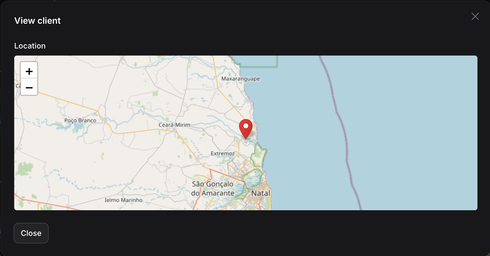

## Map Elements

### Markers

#### Creating Markers

```php
use EduardoRibeiroDev\FilamentLeaflet\Support\Markers\Marker;
use Filament\Support\Colors\Color;

protected function getMarkers(): array
{
    return [
        Marker::make(-23.5505, -46.6333)->title('Simple marker'),
        Marker::make(-23.5212, -46.4243)->green()->title('Colored marker'),
        Marker::make(-23.5266, -46.5412)->icon('https://leafletjs.com/examples/custom-icons/leaf-red.png', [32, 72]),
        Marker::make(-23.5300, -46.6400)->violet()->icon('heroicon-user-circle')->title('Heroicon marker'),
    ];
}
```


#### Marker Icons

Markers support multiple icon types with different visual behaviors:

**Custom Icon URL** (replaces the entire marker):
```php
Marker::make(-23.5505, -46.6333)
    ->icon('https://example.com/icon.png', [32, 72])
    ->title('Custom Icon Marker')
```

When using a custom icon URL, the entire marker is replaced with your custom image - the marker's color, gradient, and shadow are ignored.

**Heroicons (Filament Icons)** (icon in center):
```php
use Filament\Support\Icons\Heroicon;

Marker::make(-23.5505, -46.6333)
    ->icon(Heroicon::BuildingLibrary)        // Using Heroicon enum
    ->icon('heroicon-building-library')      // Using string
    ->heroicon('building-library')           // Using explicit heroicon() method
    ->iconSize([36, 54])
    ->title('Heroicon Marker')
    ->color(Color::Indigo);
```


When using Heroicons, the marker keeps its default styled appearance with the color gradient and shadow, and the Heroicon is automatically rendered in the center in white. The marker's color settings (`.blue()`, `.red()`, etc.) are fully respected.

**Icon Appearance:**
- **Icon URL**: Fully replaces marker appearance (color is ignored)
- **Heroicon**: Keeps marker style (with color, gradient, shadow) with the icon rendered in the center

#### Marker Colors

Markers accept colors in multiple formats:

**Using Color Class:**
```php
Marker::make(-23.5505, -46.6333)
    ->color(Color::Blue)  // Color class constant
    ->blue()              // Convenience method
```

**Using string formats:**
```php
Marker::make(-23.5505, -46.6333)
    ->color('#3388ff')           // Hex color
    ->color('rgb(51, 136, 255)') // RGB color
    ->color('oklch(59% 0.15 262)')  // OKLCH color
```

**Available convenience methods:** `blue()`, `red()`, `green()`, `orange()`, `yellow()`, `violet()`, `grey()`, `black()`, `gold()`, `randomColor()`

#### From Eloquent Models

```php
// Basic usage
Marker::fromRecord(
    record: $store,
    latColumn: 'latitude',
    lngColumn: 'longitude',
    titleColumn: 'name',
    popupFieldsColumns: ['address', 'phone'],
    color: Color::Blue,
);

// With JSON coordinates
Marker::fromRecord(
    record: $store,
    jsonColumn: 'coordinates',
    latColumn: 'lat',
    lngColumn: 'lng',
);

// With custom callback
Marker::fromRecord(
    record: $store,
    mapRecordCallback: function (Marker $marker, Model $record) {
        $marker->gold()->popupFields(['hours' => $record->hours]);
    }
);
```

### Layer Groups

Layer groups are a powerful way to organize and manage multiple layers on your map. They allow you to:

- **Toggle visibility** - Show/hide entire groups of layers at once
- **Organize layers** - Group related markers and shapes together
- **Improve performance** - Manage large datasets efficiently
- **Control layer management** - Add/remove layers from groups dynamically

#### Layer Group

A simple container for organizing related layers. Perfect for grouping logically related markers and shapes without any automatic behavior:

```php
use EduardoRibeiroDev\FilamentLeaflet\Support\Groups\LayerGroup;

protected function getMarkers(): array
{
    return [
        LayerGroup::make([
            Marker::make(-23.5505, -46.6333)->title('Store 1'),
            Marker::make(-23.5515, -46.6343)->title('Store 2'),
            Marker::make(-23.5525, -46.6353)->title('Store 3'),
        ])
        ->name('Active Stores')
        ->id('active-stores'),
    ];
}
```

**Using the `group()` helper method (shorthand):**

Instead of wrapping layers in `LayerGroup::make()`, you can use the `group()` method on any layer to automatically group multiple layers:

```php
protected function getMarkers(): array
{
    return [
        Marker::make(-23.5505, -46.6333)
            ->title('Store 1')
            ->group('Active Stores'),
        
        Marker::make(-23.5515, -46.6343)
            ->title('Store 2')
            ->group('Active Stores'),
        
        Marker::make(-23.5525, -46.6353)
            ->title('Store 3')
            ->group('Active Stores'),
    ];
}
```

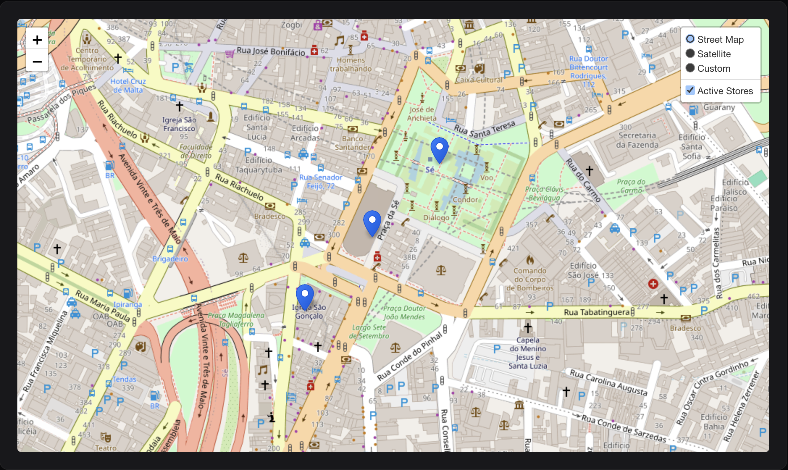

#### Feature Group

Creates a polygon envelope around all layers in the group. This is useful for visualizing the coverage area or boundary of a set of points:

```php
use EduardoRibeiroDev\FilamentLeaflet\Support\Groups\FeatureGroup;

protected function getMarkers(): array
{
    return [
        FeatureGroup::make([
            Marker::make(-23.5505, -46.6333)->title('Point 1'),
            Marker::make(-23.5515, -46.6343)->title('Point 2'),
            Marker::make(-23.5525, -46.6323)->title('Point 3'),
        ])
            ->name('Delivery Zone')
            ->blue()
            ->fillBlue()
            ->fillOpacity(0.3)
            ->weight(3)
            ->dashArray('5, 10'),
    ];
}
```

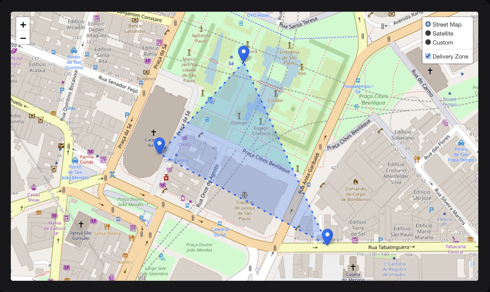

#### Marker Cluster

Groups nearby markers into clusters for better performance and visual clarity, especially with large datasets. Clusters automatically expand when zooming in:

```php
use EduardoRibeiroDev\FilamentLeaflet\Support\Groups\MarkerCluster;

protected function getMarkers(): array
{
    return [
        MarkerCluster::make([
            Marker::make(-23.5505, -46.6333)->title('Location 1'),
            Marker::make(-23.5515, -46.6343)->title('Location 2'),
            Marker::make(-23.5525, -46.6353)->title('Location 3'),
        ])
        ->maxClusterRadius(80)
        ->showCoverageOnHover()
        ->spiderfyOnMaxZoom(),
    ];
}
```


**Cluster from Model:**

Create clusters directly from Eloquent models with powerful customization:

```php
use App\Models\Store;

protected function getMarkers(): array
{
    return [
        MarkerCluster::fromModel(
            model: Store::class,
            latColumn: 'latitude',
            lngColumn: 'longitude',
            titleColumn: 'name',
            descriptionColumn: 'description',
            popupFieldsColumns: ['address', 'phone'],
            color: Color::Green,
        )
        ->maxClusterRadius(60)
        ->disableClusteringAtZoom(15),
    ];
}
```

**Cluster with Query Modification:**

Filter and customize the query used to load markers:

```php
MarkerCluster::fromModel(
    model: Store::class,
    latColumn: 'latitude',
    lngColumn: 'longitude',
    modifyQueryCallback: function ($query) {
        return $query
            ->where('status', 'active')
            ->where('city', 'São Paulo')
            ->orderBy('name');
    },
    mapRecordCallback: function (Marker $marker, Model $record) {
        // Customize each marker based on record properties
        if ($record->isPremium()) {
            $marker->gold()->icon('/images/premium-icon.png');
        }
        
        // Add status-based styling
        match($record->status) {
            'open' => $marker->green(),
            'busy' => $marker->orange(),
            'closed' => $marker->red(),
            default => $marker->grey(),
        };
        
        // Add popup with custom fields
        $marker->popupFields([
            'manager' => $record->manager_name,
            'staff' => $record->staff_count . ' employees',
            'rating' => $record->rating . ' ⭐',
        ]);
    }
);
```

**Advanced cluster configuration:**

```php
MarkerCluster::make($markers)
    ->maxClusterRadius(80)              // Cluster radius in pixels
    ->showCoverageOnHover(true)         // Highlight cluster area on hover
    ->zoomToBoundsOnClick(true)         // Zoom to cluster bounds when clicked
    ->spiderfyOnMaxZoom(true)           // Spread markers at max zoom
    ->removeOutsideVisibleBounds(true)  // Remove markers outside viewport for performance
    ->disableClusteringAtZoom(15)       // Stop clustering at zoom level 15+
    ->animate(true);                    // Animate cluster changes;
```

### Shapes

Draw various geometric shapes on your map:

#### Circles

Circles with radius in various units:

```php
use EduardoRibeiroDev\FilamentLeaflet\Support\Shapes\Circle;

protected function getShapes(): array
{
    return [
        Circle::make(-23.5505, -46.6333)
            ->popupContent('10km radius coverage')
            ->title('Service Area')
            ->blue()
            ->fillBlue()
            ->fillOpacity(0.2)
            ->radius(10000)           // Radius in meters (default)
            ->radiusInKilometers(10)  // Radius in kilometers
            ->radiusInMiles(6.2)      // Radius in miles
            ->radiusInFeet(32808)     // Radius in feet
    ];
}
```

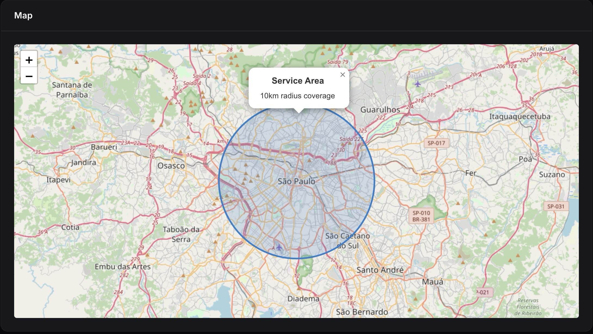

#### Circle Markers

Small circles with pixel-based radius (like markers but circular):

```php
use EduardoRibeiroDev\FilamentLeaflet\Support\Shapes\CircleMarker;

CircleMarker::make(-23.5505, -46.6333)
    ->radius(45) // Radius in pixels
    ->red()
    ->fillRed()
    ->weight(2)
    ->title('Point of Interest');
```

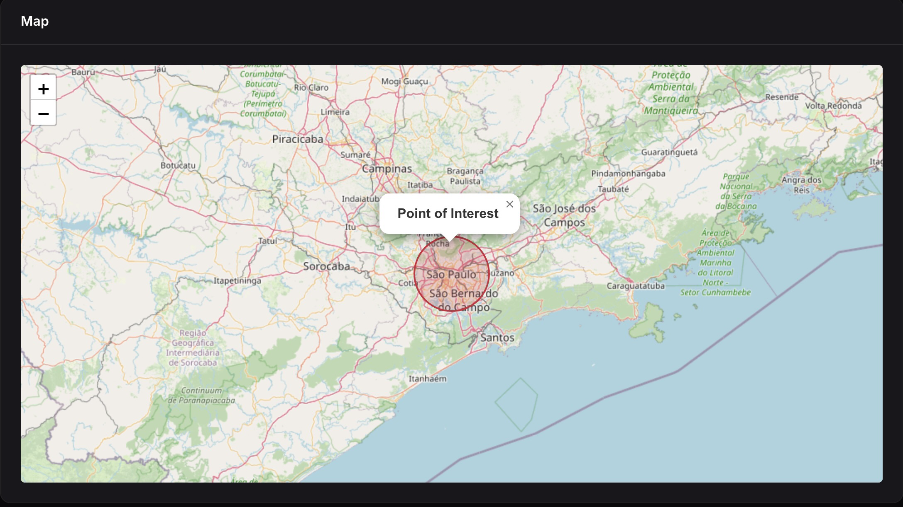

#### Polygons

Draw custom polygons:

```php
use EduardoRibeiroDev\FilamentLeaflet\Support\Shapes\Polygon;

// Define a polygon area
Polygon::make(
    [-23.5505, -46.6333],
    [-23.5515, -46.6343],
    [-23.5525, -46.6323],
    [-23.5505, -46.6333], // Close the polygon
)
->green()
->fillGreen()
->fillOpacity(0.3)
->title('Delivery Zone')
->popupContent('We deliver to this area');

// Or build point by point
Polygon::make()
    ->addPoint(-23.5505, -46.6333)
    ->addPoint(-23.5515, -46.6343)
    ->addPoint(-23.5525, -46.6323)
    ->addPoint(-23.5505, -46.6333)
    ->blue();
```

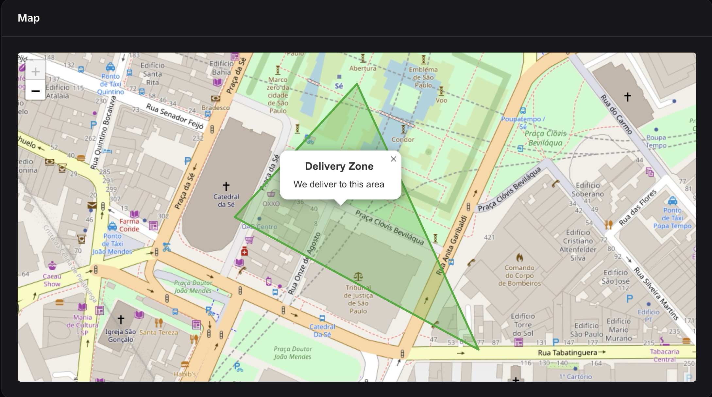

#### Polylines

Draw lines connecting multiple points:

```php
use EduardoRibeiroDev\FilamentLeaflet\Support\Shapes\Polyline;

// Route or path
Polyline::make(
    [-23.5505, -46.6333],
    [-23.5515, -46.6343],
    [-23.5525, -46.6353],
    [-23.5535, -46.6363],
)
->blue()
->weight(4)
->opacity(0.7)
->dashArray('10, 5')      // Dashed line
->smoothFactor(1.5)       // Smooth curves
->title('Delivery Route');

// Or build incrementally
Polyline::make()
    ->addPoint(-23.5505, -46.6333)
    ->addPoint(-23.5515, -46.6343)
    ->addPoint(-23.5525, -46.6353)
    ->red()
    ->weight(3);
```

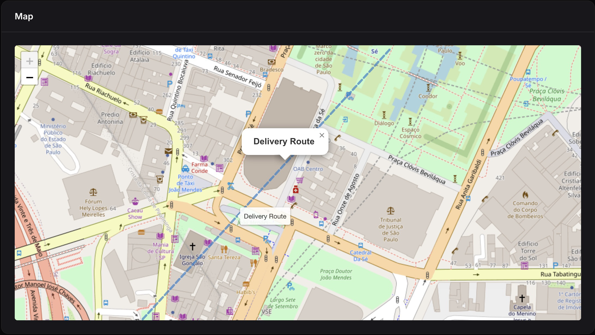

#### Rectangles

Draw rectangular bounds:

```php
use EduardoRibeiroDev\FilamentLeaflet\Support\Shapes\Rectangle;

// Using corner coordinates
Rectangle::make(
    [-23.5505, -46.6333],  // Southwest corner
    [-23.5525, -46.6353]   // Northeast corner
)
->orange()
->fillOrange()
->fillOpacity(0.2)
->title('Restricted Area');

// Alternative syntax
Rectangle::makeFromCoordinates(
    -23.5505, -46.6333,    // Southwest lat, lng
    -23.5525, -46.6353     // Northeast lat, lng
)
->red();
```

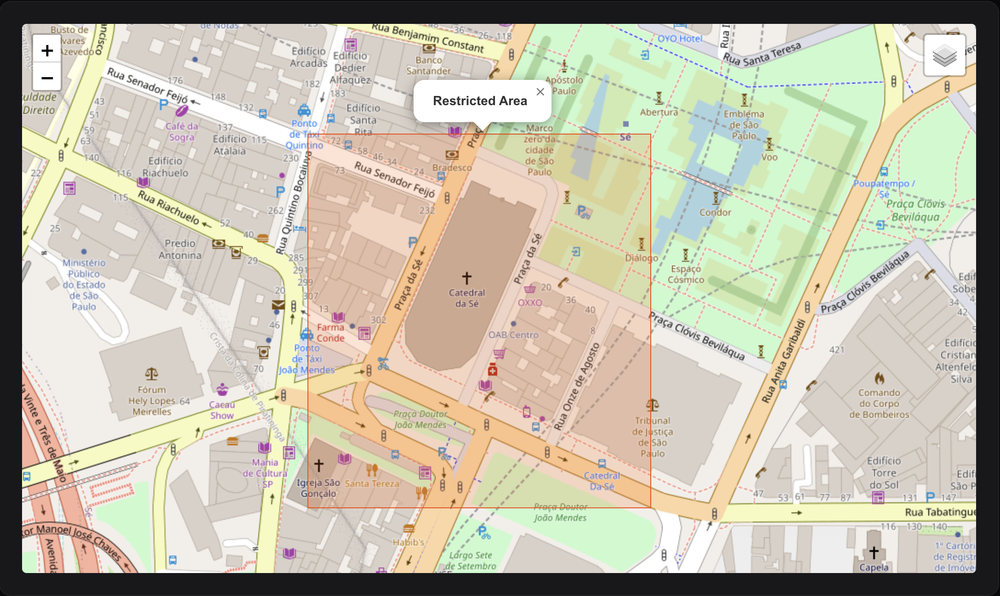

#### Shapes from Eloquent Models

All shape classes support `fromRecord()` factory methods for easy creation from database records:

```php
use App\Models\DeliveryZone;
use EduardoRibeiroDev\FilamentLeaflet\Support\Shapes\Circle;
use EduardoRibeiroDev\FilamentLeaflet\Support\Shapes\Polygon;
use EduardoRibeiroDev\FilamentLeaflet\Support\Shapes\Polyline;
use EduardoRibeiroDev\FilamentLeaflet\Support\Shapes\Rectangle;
use EduardoRibeiroDev\FilamentLeaflet\Support\Shapes\CircleMarker;

protected function getShapes(): array
{
    return DeliveryZone::all()->map(function ($zone) {
        // Circle from record
        return Circle::fromRecord(
            record: $zone,
            latColumn: 'latitude',
            lngColumn: 'longitude',
            titleColumn: 'name',
            descriptionColumn: 'description',
            popupFieldsColumns: ['address', 'radius'],
        );
    })->all();
}
```

**Improved Support for JSON Columns:**

Shapes now intelligently handle JSON-stored coordinates:

```php
Circle::fromRecord(
    record: $zone,
    jsonColumn: 'center_coordinates',  // Stores: { "lat": -23.5505, "lng": -46.6333 }
    latColumn: 'lat',                   // Keys within the JSON
    lngColumn: 'lng',
);
```

Each shape type supports the `fromRecord()` method with common parameters:
- `record`: The Eloquent model instance
- `latColumn`/`lngColumn`: Column names for coordinates (for Circle, CircleMarker)
- `radiusColumn`: Column name for radius (for Circle, CircleMarker)
- `jsonColumn`: Column name for JSON coordinates (case of storing lat/lng as JSON)
- `pointsColumn`: Column name for points array (for Polygon, Polyline)
- `boundsColumn`: Column name for bounds array (for Rectangle)
- `titleColumn`: Column name for the shape title
- `descriptionColumn`: Column name for the popup content
- `popupFieldsColumns`: Array of column names to include in popup
- `color`: Default color for the shape
- `mapRecordCallback`: Closure to customize the shape based on the record

##### Circle from Record

```php
Circle::fromRecord(
    record: $zone,
    latColumn: 'center_lat',
    lngColumn: 'center_lng',
    radiusColumn: 'coverage_radius_km',
    titleColumn: 'zone_name',
    descriptionColumn: 'zone_description',
    mapRecordCallback: fn(Circle $circle, $record) => 
        $circle->radiusInKilometers($record->coverage_radius_km)
);
```

##### Polygon from Record

```php
// Assumes database structure: points => [[lat, lng], [lat, lng], ...]
Polygon::fromRecord(
    record: $zone,
    pointsColumn: 'boundary_points',
    titleColumn: 'zone_name',
    popupFieldsColumns: ['area_sqkm', 'population'],
);
```

##### Polyline from Record

```php
// Store route as JSON array of [lat, lng] coordinates
Polyline::fromRecord(
    record: $deliveryRoute,
    pointsColumn: 'route_path',
    titleColumn: 'route_name',
    descriptionColumn: 'destination',
    mapRecordCallback: fn(Polyline $line, $record) =>
        $record->is_completed 
            ? $line->green()->weight(2)
            : $line->red()->weight(3)
);
```

##### Rectangle from Record

```php
// Assumes database structure: bounds => [[lat1, lng1], [lat2, lng2]]
Rectangle::fromRecord(
    record: $territory,
    boundsColumn: 'service_bounds',
    titleColumn: 'territory_name',
    popupFieldsColumns: ['region', 'sales_person'],
);
```

#### Shape Styling
```php
Circle::make(-23.5505, -46.6333)
    ->radius(5000)
    
    // Border styling
    ->color(Color::Blue)        // Border color
    ->weight(3)                 // Border width in pixels
    ->opacity(0.8)              // Border opacity (0-1)
    ->dashArray('5, 10')        // Dashed border pattern
    
    // Fill styling
    ->fillColor(Color::Green)   // Fill color
    ->fillOpacity(0.3)          // Fill opacity (0-1)
```

### Editable Layers

Make markers and shapes editable directly on the map by enabling the draw control:

```php
class MyMapWidget extends MapWidget
{
    protected bool $hasEditLayersControl = true;
    
    protected function getMarkers(): array
    {
        return [
            Marker::make(-23.5505, -46.6333)
                ->title('Editable Marker')
                ->editable(),  // Make this marker editable
            
            Circle::make(-23.5505, -46.6333)
                ->radiusInKilometers(5)
                ->editable(),  // Make this circle editable
        ];
    }
}
```

You can also make all layers in a group editable:

```php
LayerGroup::make([
    Marker::make(-23.5505, -46.6333)->title('Point 1'),
    Marker::make(-23.5515, -46.6343)->title('Point 2'),
    Marker::make(-23.5525, -46.6353)->title('Point 3'),
])
->name('Editable Points')
->editable(),  // All markers in the group are now editable
```

## User Interactions

### Popups and Tooltips

#### Tooltips (appear on hover)

```php
Marker::make(-23.5505, -46.6333)
    ->tooltip(
        content: 'São Paulo City',
        permanent: false,
        direction: 'top',
        options: ['offset' => [0, -20]]
    );

// Or using individual methods
Marker::make(-23.5505, -46.6333)
    ->tooltipContent('São Paulo')
    ->tooltipPermanent(true)
    ->tooltipDirection('top');
```

#### Popups (appear on click)

```php
Marker::make(-23.5505, -46.6333)
    ->popupTitle('Store Location')
    ->popupContent('Visit our main store')
    ->popupFields([
        'address' => '123 Main Street',
        'phone' => '+55 11 1234-5678',
        'email' => 'contact@store.com',
    ])
    ->popupOptions(['maxWidth' => 300]);

// Or use shorthand
Marker::make(-23.5505, -46.6333)
    ->popup(
        content: 'Store description',
        fields: ['address' => '123 Main St', 'phone' => '+55 11 1234-5678'],
        options: ['maxWidth' => 300]
    );
```

**How popup fields work:** Keys are automatically converted to title case, underscores replaced with spaces, and translated using Laravel's `__()` helper. Both keys and values support translation keys.

#### Combined Usage

```php
Marker::make(-23.5505, -46.6333)
    ->title('Pizza Palace')
    ->popupContent('Best pizza in town')
    ->popupFields([
        'address' => '123 Main St',
        'phone' => '+55 11 1234-5678',
        'rating' => '4.5 ⭐',
    ]);
```

### Click Actions

#### Marker Click Handler

```php
use Filament\Notifications\Notification;

Marker::make(-23.5505, -46.6333)
    ->title('Interactive Marker')
    ->action(function (Marker $marker) { // Or ->onClick()
        Notification::make()
            ->title('Marker Clicked!')
            ->body('ID: ' . $marker->getId())
            ->send();
    });
```

#### Shape Click Handler

```php
Circle::make(-23.5505, -46.6333)
    ->radius(5000)
    ->action(function (Circle $circle) { // Or ->onClick()
        Notification::make()
            ->title('Circle clicked')
            ->send();
    });
```

#### From Model Records

```php
protected function getMarkers(): array
{
    return Store::all()->map(function ($store) {
        return Marker::fromRecord(
            record: $store,
            latColumn: 'latitude',
            lngColumn: 'longitude',
        )->action(function (Marker $marker, Store $record) { // Or ->onClick()
            Notification::make()
                ->title("You clicked: {$record->name}")
                ->body("Address: {$record->address}")
                ->send();
            
            return redirect()->route('stores.show', $record);
        });
    })->all();
}
```

#### Map Click Handler

Handle clicks on the map itself:

```php
public function handleMapClick(float $latitude, float $longitude): void
{
    Notification::make()
        ->title('Map clicked')
        ->body("Coordinates: {$latitude}, {$longitude}")
        ->send();
}
```

#### Field/Entry/Column Click Handlers

Handle map clicks in form fields, infolists, or table columns:

```php
use EduardoRibeiroDev\FilamentLeaflet\Fields\MapPicker;
use Filament\Notifications\Notification;

MapPicker::make('location')
    ->height(300)
    ->onMapClick(function (float $latitude, float $longitude) {
        Notification::make()
            ->title('Location Selected')
            ->body("Lat: {$latitude}, Lng: {$longitude}")
            ->send();
    });
```

Handle layer (marker/shape) clicks:

```php
MapPicker::make('location')
    ->height(300)
    ->onLayerClick(function (array $layer) {
        Notification::make()
            ->title('Layer Clicked')
            ->body("Layer ID: {$layer['id']}")
            ->send();
    });
```

## Advanced Features

### Model Integration & CRUD Operations

Enable creating markers directly from map clicks:

```php
use App\Models\Location;

class LocationMapWidget extends MapWidget
{
    protected ?string $markerModel = Location::class;
    protected string $latitudeColumnName = 'latitude';
    protected string $longitudeColumnName = 'longitude';
    protected ?string $jsonCoordinatesColumnName = 'coordinates'; // For JSON storage
    
    protected function getFormComponents(): array
    {
        return [
            TextInput::make('name')->required(),
            Select::make('color')->options(Color::class),
            Textarea::make('description')->columnSpanFull(),
        ];
    }
}
```

When users click the map, a form modal opens to create a new marker. If coordinates are stored as JSON, the widget automatically converts latitude/longitude into the configured JSON column.

**Built-in Marker Actions:**

Define custom actions to execute when clicking markers with records using the `$markerClickAction` property:

```php
use App\Models\Store;

class LocationMapWidget extends MapWidget
{
    protected ?string $markerModel = Store::class;
    protected string $latitudeColumnName = 'latitude';
    protected string $longitudeColumnName = 'longitude';
    
    // Define the action to execute when a marker is clicked
    protected ?string $markerClickAction = 'view'; // 'view', 'edit', 'delete' or null
    
    protected function getMarkers(): array
    {
        return Store::all()->map(fn($store) => 
            Marker::fromRecord(
                record: $store,
                latColumn: 'latitude',
                lngColumn: 'longitude',
                titleColumn: 'name',
            )
        )->all();
    }
}
```

**Available marker click actions:**

- `'view'` - Display a read-only modal with the marker's record details
- `'edit'` - Open an edit form for the marker's record (default)
- `'delete'` - Prompt to delete the marker's record
- `null` - No action

**Using a Resource Form:**

```php
use App\Filament\Resources\Locations\LocationResource;

class LocationMapWidget extends MapWidget
{
    protected ?string $markerModel = Location::class;
    protected ?string $markerResource = LocationResource::class;
}
```

**Hooks:**

```php
protected function afterMarkerCreated(Model $record): void
{
    Notification::make()
        ->title('Location created!')
        ->body("Created: {$record->name}")
        ->success()
        ->send();
}

protected function mutateFormDataBeforeCreate(array $data): array
{
    $data['user_id'] = auth()->id();
    $data['status'] = 'active';
    return parent::mutateFormDataBeforeCreate($data);
}
```

**Keep Maps in Sync with Tables:**

```php
use EduardoRibeiroDev\FilamentLeaflet\Concerns\InteractsWithMap;

class ManageLocations extends ManageRecords
{
    use InteractsWithMap;
}
```

This automatically refreshes the map after create/edit/delete actions.

### GeoJSON Density Maps

Display choropleth maps with custom density data:

```php
class BrazilDensityWidget extends MapWidget
{
    protected ?string $geoJsonUrl = 'https://example.com/brazil-states.json';
    
    protected array $geoJsonColors = [
        '#FED976', '#FEB24C', '#FD8D3C', '#FC4E2A', 
        '#E31A1C', '#BD0026', '#800026',
    ];
    
    protected function getGeoJsonData(): array
    {
        return [
            'SP' => 166.23,  // São Paulo
            'RJ' => 365.23,  // Rio de Janeiro
            'MG' => 33.41,   // Minas Gerais
        ];
    }
    
    protected function getGeoJsonTooltip(): string
    {
        return <<<HTML
            <h4>{state}</h4>
            <b>Population Density: {density} per km²</b>
        HTML;
    }
}
```

Colors are automatically applied based on data distribution.

### Multi-Language Support

The package includes built-in support for: English (en), Portuguese (pt_BR, pt_PT), Spanish (es), French (fr), German (de), Italian (it).

All draw control labels, tooltips, and messages are automatically translated based on your application's locale.

To customize translations:

```bash
php artisan vendor:publish --tag=filament-leaflet-translations
```

Then edit files in `lang/vendor/filament-leaflet`.

## Best Practices

### Performance Optimization

1. **Use Marker Clusters** for large datasets:
```php
// Bad: 1000 individual markers
protected function getMarkers(): array
{
    return Store::all()->map(fn($s) => Marker::fromRecord($s))->all();
}

// Good: Clustered markers
protected function getMarkers(): array
{
    return [
        MarkerCluster::fromModel(Store::class)
            ->maxClusterRadius(80)
    ];
}
```

2. **Limit data** with query modifications:
```php
MarkerCluster::fromModel(
    model: Store::class,
    modifyQueryCallback: fn($q) => $q->limit(100)->latest()
)
```

3. **Use appropriate zoom levels**:
```php
protected int $defaultZoom = 12;  // City level
protected int $maxZoom = 18;      // Street level
protected int $minZoom = 3;       // Country level
```

### Debugging

Enable logging for map interactions:

```php
public function handleMapClick(float $latitude, float $longitude): void
{
    logger("Map clicked", compact('latitude', 'longitude'));
}
```

## Configuration Reference

### Customization

#### Custom Styles

Add custom CSS to your map:

```php
public function getCustomStyles(): string
{
    return <<<CSS
        .custom-marker {
            filter: hue-rotate(45deg);
        }
        
        .leaflet-popup-content {
            font-family: 'Inter', sans-serif;
        }
    CSS;
}
```

#### Custom Scripts

Execute JavaScript after map initialization:

```php
public function getCustomScripts(): string
{
    return <<<JS
        function customFunction() {
            // Your code
        }
    JS;
}
```

### Method Reference

#### MapWidget

| Method | Description |
|--------|-------------|
| `getHeading()` | Returns the widget heading |
| `getAutoCenter()` | Returns the auto-center setting |
| `getMarkers()` | Returns array of markers to display |
| `getShapes()` | Returns array of shapes to display |
| `getLayers()` | Returns combined markers and shapes |
| `onMapClick($lat, $lng)` | Handles map click events |
| `onLayerClick($layerId)` | Handles layer click events |
| `refreshMap()` | Manually refresh the map |
| `afterMarkerCreated($record)` | Hook after marker creation |
| `mutateFormDataBeforeCreate($data)` | Transform form data before save |
| `$markerClickAction` | Define action for marker clicks (view/edit/delete) |
| `$markerModel` | Eloquent model class for markers (enables CRUD) |
| `$markerResource` | Optional Filament Resource for marker actions |

#### MapPicker

| Method | Description |
|--------|-------------|
| `make($name)` | Create a new MapPicker field |
| `autoCenter(bool)` | Auto-center map to user's current location |
| `center($lat, $lng)` | Set map center coordinates |
| `zoom($level)` | Set initial zoom level |
| `height($pixels)` | Set map height |
| `mapDraggable($bool)` | Enable/disable map dragging |
| `mapZoomable($bool)` | Enable/disable map zooming |
| `static()` | Disable all map interactions (dragging & zooming) |
| `recenterTimeout($milliseconds)` | Auto-recenter map after X ms of inactivity |
| `tileLayersUrl($layers)` | Set tile layer(s) |
| `markers($array)` | Set initial markers |
| `shapes($array)` | Set initial shapes |
| `geoJsonUrl($url)` | Set GeoJSON URL |
| `geoJsonData($data)` | Set GeoJSON density data |
| `geoJsonTooltip($tooltip)` | Set GeoJSON tooltip template |
| `latitudeFieldName($name)` | Customize latitude field name |
| `longitudeFieldName($name)` | Customize longitude field name |
| `storeAsJson($bool)` | Store coordinates as JSON in single column |
| `pickMarker($marker)` | Customize the temporary marker shown on click |
| `onMapClick($callback)` | Handle map click events with closure callback |
| `onLayerClick($callback)` | Handle layer click events with closure callback |
| `handleMapClick($lat, $lng)` | Exposed Livewire method for map clicks |
| `handleLayerClick($layerId)` | Exposed Livewire method for layer clicks |

#### MapEntry

| Method | Description |
|--------|-------------|
| `make($name)` | Create a new MapEntry entry |
| `autoCenter(bool)` | Auto-center map to user's current location |
| `center($lat, $lng)` | Set map center coordinates |
| `zoom($level)` | Set initial zoom level |
| `height($pixels)` | Set map height |
| `mapDraggable($bool)` | Enable/disable map dragging |
| `mapZoomable($bool)` | Enable/disable map zooming |
| `static()` | Disable all map interactions (dragging & zooming) |
| `recenterTimeout($milliseconds)` | Auto-recenter map after X ms of inactivity |
| `tileLayersUrl($layers)` | Set tile layer(s) |
| `markers($array)` | Set initial markers |
| `shapes($array)` | Set initial shapes |
| `geoJsonUrl($url)` | Set GeoJSON URL |
| `geoJsonData($data)` | Set GeoJSON density data |
| `geoJsonTooltip($tooltip)` | Set GeoJSON tooltip template |
| `latitudeFieldName($name)` | Customize latitude field name |
| `longitudeFieldName($name)` | Customize longitude field name |
| `storeAsJson($bool)` | Store coordinates as JSON in single column |
| `pickMarker($marker)` | Customize the temporary marker shown on click |
| `onMapClick($callback)` | Handle map click events with closure callback |
| `onLayerClick($callback)` | Handle layer click events with closure callback |

#### MapColumn

| Method | Description |
|--------|-------------|
| `make($name)` | Create a new MapColumn column |
| `autoCenter(bool)` | Auto-center map to user's current location |
| `center($lat, $lng)` | Set map center coordinates |
| `zoom($level)` | Set initial zoom level |
| `height($pixels)` | Set map height |
| `circular($value)` | Display map as circular container |
| `mapDraggable($bool)` | Enable/disable map dragging |
| `mapZoomable($bool)` | Enable/disable map zooming |
| `static()` | Disable all map interactions (dragging & zooming) |
| `recenterTimeout($milliseconds)` | Auto-recenter map after X ms of inactivity |
| `tileLayersUrl($layers)` | Set tile layer(s) |
| `markers($array)` | Set initial markers |
| `shapes($array)` | Set initial shapes |
| `geoJsonUrl($url)` | Set GeoJSON URL |
| `geoJsonData($data)` | Set GeoJSON density data |
| `geoJsonTooltip($tooltip)` | Set GeoJSON tooltip template |
| `latitudeFieldName($name)` | Customize latitude field name |
| `longitudeFieldName($name)` | Customize longitude field name |
| `storeAsJson($bool)` | Store coordinates as JSON in single column |
| `pickMarker($marker)` | Customize the temporary marker shown on click |
| `onMapClick($callback)` | Handle map click events with closure callback |
| `onLayerClick($callback)` | Handle layer click events with closure callback |

#### Marker
| Method | Description |
|--------|-------------|
| `make($lat, $lng)` | Create a new marker |
| `fromRecord()` | Create marker from Eloquent model |
| `id($id)` | Set marker ID |
| `title($title)` | Set title (tooltip & popup) |
| `color($color)` | Set marker color |
| `icon($icon, $size)` | Set custom icon URL or Heroicon |
| `iconUrl($url)` | Set custom icon URL |
| `iconSize($size)` | Set icon size as [width, height] |
| `heroicon($icon)` | Set Heroicon (string or Heroicon enum) |
| `draggable($bool)` | Make marker draggable |
| `editable($bool)` | Make marker editable on the map |
| `group($group)` | Assign to group (string or BaseLayerGroup) |
| `popup($content, $fields, $options)` | Configure popup |
| `tooltip($content, $permanent, $direction, $options)` | Configure tooltip |
| `action($callback)` | Set click handler |
| `distanceTo($marker)` | Calculate distance to another marker |
| `validate()` | Validate coordinates |

#### Shape (All Shapes)

| Method | Description |
|--------|-------------|
| `color($color)` | Set border color |
| `fillColor($color)` | Set fill color |
| `weight($pixels)` | Set border width |
| `opacity($value)` | Set border opacity (0-1) |
| `fillOpacity($value)` | Set fill opacity (0-1) |
| `dashArray($pattern)` | Set dash pattern |
| `editable($bool)` | Make shape editable on the map |
| `popup($content, $fields, $options)` | Configure popup |
| `tooltip($content, $permanent, $direction, $options)` | Configure tooltip |
| `action($callback)` | Set click handler |
| `group($group)` | Assign to group (string or BaseLayerGroup) |
| `getCoordinates()` | Get center coordinates of the shape |

#### Circle

| Method | Description |
|--------|-------------|
| `make($lat, $lng)` | Create circle |
| `radius($meters)` | Set radius in meters |
| `radiusInMeters($meters)` | Set radius in meters |
| `radiusInKilometers($km)` | Set radius in kilometers |
| `radiusInMiles($miles)` | Set radius in miles |
| `radiusInFeet($feet)` | Set radius in feet |

#### CircleMarker

| Method | Description |
|--------|-------------|
| `make($lat, $lng)` | Create circle marker |
| `radius($pixels)` | Set radius in pixels |

#### Polygon & Polyline

| Method | Description |
|--------|-------------|
| `make($coordinates)` | Create with coordinates |
| `addPoint($lat, $lng)` | Add vertex/point |

#### Polyline

| Method | Description |
|--------|-------------|
| `smoothFactor($factor)` | Set line smoothing |

#### Rectangle

| Method | Description |
|--------|-------------|
| `make($corner1, $corner2)` | Create with corners |
| `makeFromCoordinates($lat1, $lng1, $lat2, $lng2)` | Create with coordinates |

#### Layer Group (Base)

| Method | Description |
|--------|-------------|
| `make($layers)` | Create layer group with layers |
| `id($id)` | Set group ID |
| `name($name)` | Set group name |
| `option($key, $value)` | Set a group option |
| `getLayers()` | Get all layers in the group |

#### LayerGroup

| Method | Description |
|--------|-------------|
| `make($layers)` | Create simple layer group |
| `name($name)` | Set user-visible group name |
| `id($id)` | Set group ID for controls |
| `editable($bool)` | Make all layers in group editable |

#### FeatureGroup

| Method | Description |
|--------|-------------|
| `make($markers)` | Create feature group from markers |
| `name($name)` | Set zone/area name |
| `blue()`, `red()`, etc. | Set border color |
| `fillBlue()`, `fillRed()`, etc. | Set fill color |
| `fillOpacity($value)` | Set fill transparency (0-1) |
| `weight($pixels)` | Set border width |
| `editable($bool)` | Make all layers in group editable |

#### MarkerCluster

| Method | Description |
|--------|-------------|
| `make($markers)` | Create cluster with markers |
| `fromModel()` | Create cluster from Eloquent model |
| `marker($marker)` | Add single marker |
| `markers($array)` | Add multiple markers |
| `name($name)` | Set cluster group name |
| `editable($bool)` | Make all markers in cluster editable |
| `maxClusterRadius($pixels)` | Set cluster radius (pixels) |
| `showCoverageOnHover($bool)` | Show cluster coverage on hover |
| `zoomToBoundsOnClick($bool)` | Zoom to bounds when clicked |
| `spiderfyOnMaxZoom($bool)` | Spread markers at max zoom |
| `disableClusteringAtZoom($level)` | Disable clustering at zoom level |
| `animate($bool)` | Animate cluster changes |
| `modifyQueryUsing($callback)` | Modify database query |
| `mapRecordUsing($callback)` | Customize each marker |

## Color Reference

Markers and shapes accept colors from multiple sources:

## Tile Layer Reference

Available tile layer providers:

- `TileLayer::OpenStreetMap` - Free, open-source map tile provider
- `TileLayer::GoogleStreets` - Google Streets map layer
- `TileLayer::GoogleSatellite` - Google Satellite imagery layer
- `TileLayer::GoogleHybrid` - Google hybrid (streets + satellite) layer
- `TileLayer::GoogleTerrain` - Google terrain layer
- `TileLayer::EsriWorldImagery` - ESRI World Imagery layer
- `TileLayer::EsriWorldStreetMap` - ESRI World Street Map
- `TileLayer::EsriNatGeo` - ESRI National Geographic layer
- `TileLayer::CartoPositron` - Carto Positron light map
- `TileLayer::CartoDarkMatter` - Carto Dark Matter map
- `TileLayer::Mapbox` - Mapbox tiles (requires configured Access Token)

## Concern Methods Reference

### HasGeoJsonFile

| Method | Description |
|--------|-------------|
| `getGeoJsonFileAttributeName()` | Returns the model attribute storing GeoJSON (default: 'geojson') |
| `getGeoJsonFileDisk()` | Returns the storage disk for the file (default: null = local) |
| `getExpirationTime()` | Returns DateTime for temporary URL expiration (default: null = permanent) |
| `getGeoJsonUrl()` | Returns the accessible URL for the GeoJSON file |

### Map Configuration Properties

These properties control core map behavior:

| Property | Type | Default | Description |
|----------|------|---------|-------------|
| `$mapCenter` | array | [-14.235, -51.9253] | Initial map center [latitude, longitude] |
| `$autoCenter` | bool | false | Auto-center to user's current location on load |
| `$defaultZoom` | int | 4 | Initial zoom level |
| `$mapHeight` | int | 504 | Map height in pixels |
| `$mapDraggable` | bool | true | Allow users to pan by dragging |
| `$mapZoomable` | bool | true | Allow users to zoom (scroll wheel, pinch) |
| `$recenterMapTimeout` | ?int | null | Auto-recenter after X milliseconds of panning |
| `$maxZoom` | int | 18 | Maximum zoom level allowed |
| `$minZoom` | int | 2 | Minimum zoom level allowed |
| `$hasDrawMarkerControl` | bool | false | Show draw marker control |
| `$hasDrawCircleMarkerControl` | bool | false | Show draw circle marker toolbar |
| `$hasDrawCircleControl` | bool | false | Show draw circle toolbar |
| `$hasDrawPolylineControl` | bool | false | Show draw polyline toolbar |
| `$hasDrawRectangleControl` | bool | false | Show draw rectangle toolbar |
| `$hasDrawPolygonControl` | bool | false | Show draw polygon toolbar |
| `$hasDrawTextControl` | bool | false | Show draw text toolbar |
| `$hasEditLayersControl` | bool | false | Show edit layers toolbar |
| `$hasDragLayersControl` | bool | false | Show drag layers toolbar |
| `$hasRemoveLayersControl` | bool | false | Show remove layers toolbar |
| `$hasRotateLayersControl` | bool | false | Show rotate layers toolbar |
| `$hasCutPolygonControl` | bool | false | Show cut polygon toolbar |
| `$hasFullscreenControl` | bool | false | Show fullscreen button |
| `$hasSearchControl` | bool | false | Show address search |
| `$hasScaleControl` | bool | false | Show distance scale |
| `$hasZoomControl` | bool | true | Show zoom +/- buttons |
| `$hasAttributionControl` | bool | false | Show attribution text |
| `$tileLayersUrl` | mixed | OpenStreetMap | Base map tile layers |

## License

This package is open-sourced software licensed under the MIT license.

## Credits

- Built for [Filament](https://filamentphp.com)
- Uses [Leaflet](https://leafletjs.com) for mapping
- Created by [Eduardo Ribeiro](https://github.com/eduardoribeirodev)

## Support

For issues, questions, or contributions, please visit the [GitHub repository](https://github.com/eduardoribeirodev/filament-leaflet). Don't forget, Jesus loves you ❤️.